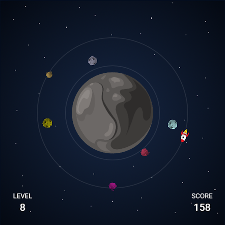

# AROUND

## About

Around is an **endless runner** game where the main goal is to survive as long as you can (achieve the **highest score**). The player is controlling the spaceship **orbiting** the **procedurally generated** planet. An entirely new planet is generated for each level (one full loop around a planet), as are the surrounding asteroids. The player has to **change** its orbit to **avoid** asteroids. Crushing into an asteroid will end the game. Passing by will increase the score, which is multiplied by the current level. The player has a special **shooting ability** available once per level to **destroy** those asteroids in emergencies.

You can **play in the browser** by clicking [here](https://m-biernat.itch.io/around) or [here](https://m-biernat.github.io/around/).

## Tools & Dependencies

 - [Phaser CE v2.11.1](https://phaser.io/download/release/2.11.1) - game engine;
 - [UglifyJS](https://www.npmjs.com/package/uglify-js) - to bundle and minify the game package;
 - [GIMP](https://www.gimp.org/) - to create assets.

## Credits

 - **Michał Biernat** @[m-biernat](https://github.com/m-biernat) - game designer and programmer;
 - **Anna Hosumbek** @[An-Hos](https://github.com/An-Hos) - graphic designer and tester.

## License

All rights reserved ([no license](https://choosealicense.com/no-permission/)): 
 - You **can** view (peek into the code and assets) and fork this repository;
 - You **cannot** reproduce, distribute, or create derivative works;
 - You **can** play the game (*"AROUND"*) free of charge via the provided channels.